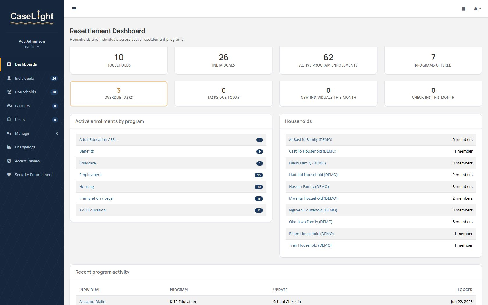
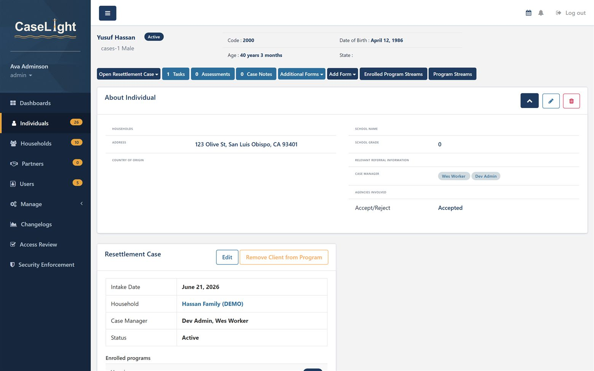
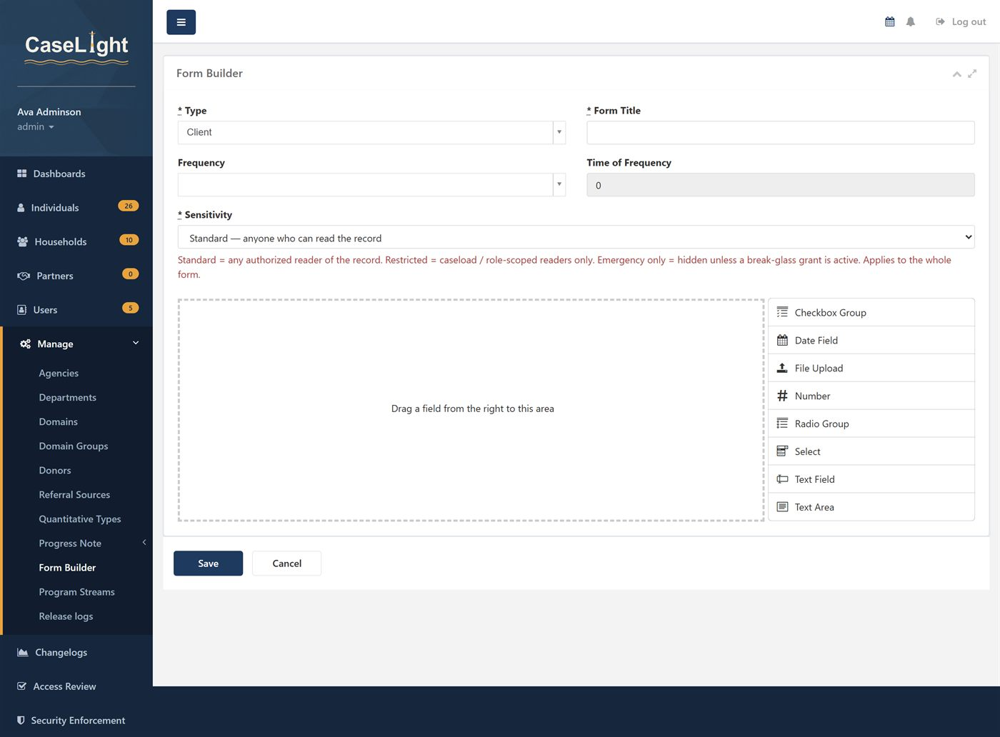
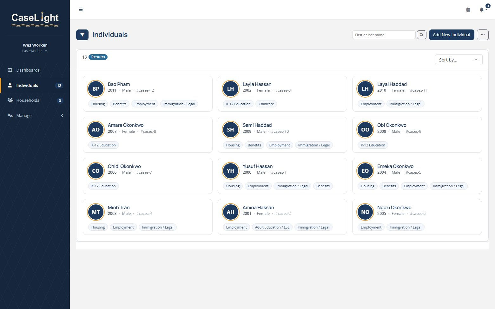
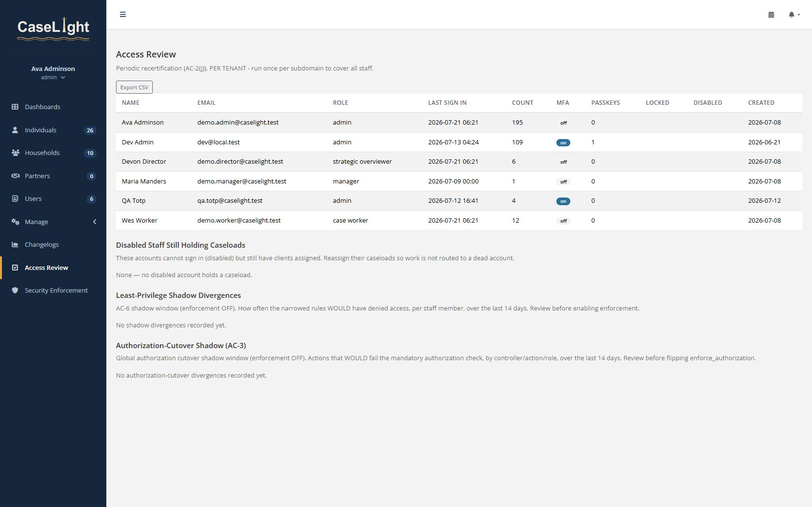

<p align="center">
  <picture>
    <source media="(prefers-color-scheme: dark)" srcset="app/assets/images/brand/caselight-logo-ondark.png">
    
  </picture>
</p>

<p align="center"><em>Open-source case management for nonprofits — by Lighthouse Nonprofit Technologies.</em></p>

<p align="center">
  
</p>

<p align="center">
  <a href="docs/user-guide.md"><b>User Guide</b></a> ·
  <a href="#features">Features</a> ·
  <a href="#security--authentication">Security</a> ·
  <a href="docs/compliance/">Compliance</a> ·
  <a href="#quickstart">Quickstart</a>
</p>

<p align="center"><sub>Screens throughout the docs show synthetic demo data only.</sub></p>

**CaseLight** is a containerized, modernized fork of **OSCaR** (Open Source
Case-management and Record-keeping), maintained by **Lighthouse Nonprofit Technologies**
for nonprofit case management — tracking individuals, households, programs, assessments,
and case notes.

## Status

CaseLight runs a **modernized, supported stack — backend and frontend**. The application was
migrated off the end-of-life **Ruby 2.3.3 / Rails 4.2** it inherited from upstream OSCaR up to
current, maintained versions, and the frontend/asset-pipeline EOL set was retired rung-by-rung
in 2026-07 (**POAM-017a–e closed**; the remaining eval-based form/query-builder pair is tracked
under **POAM-017f** in [`docs/compliance/`](docs/compliance)):

- **Ruby 4.0.5 / Rails 7.2.3.1** — migrated rung by rung (4.2 → 5.0 → 5.1 → 5.2 → 6.0 →
  6.1 → 7.0 → 7.1 → 7.2), each step verified green before the next. Zeitwerk autoloading and a
  modern gem set throughout (Devise 5, Mongoid 8, ros-apartment 3.4, active_model_serializers 0.10,
  paper_trail 15, factory_bot 6, …).
- **PostgreSQL 17** as the primary store (was 9.6), **MongoDB 6.0** for change/audit history
  (was 3.6), **Redis + Sidekiq** for background jobs — all migrated to current versions.
- **Containerized deployment** so the runtime lives only inside a pinned Docker image and
  the host OS never has to carry the toolchain.
- An **application-layer security baseline** being hardened toward **FedRAMP Moderate** and
  **SOC 2** auditability — multi-factor authentication (TOTP + WebAuthn passkeys), account
  lockout and brute-force throttling, enforced HTTPS/HSTS and a strict security-header set,
  field-level encryption, and a CI security pipeline (SAST + dependency-CVE + secret scanning).
  See **[Security & authentication](#security--authentication)** below and
  [`docs/compliance/`](docs/compliance).
- **English-only** UI (upstream shipped English + Khmer) and **local asset-serving** so the
  app renders correctly self-hosted, without external object storage.

Intentionally **not** carried over from upstream for the current pilot scope: the Khmer
locale, the Thredded community forum, and the v1 mobile API.

## Features

CaseLight models the real shape of frontline casework — and lets staff reshape it without code.

- **Individuals & households** — every person sits inside a household, cross-linked and one click
  apart, with assigned case managers, referral source, status, and program tags.
- **Configurable without code** — custom forms, enrollable **program streams**, and structured
  **assessments** are all built and edited in-app via a drag-and-drop form builder; no migrations.
- **Programs over time** — enroll people in the programs you actually run and log dated check-ins;
  tasks, case notes, and documents live on every case.
- **Role-aware views** — administrators and directors get a dense, sortable roster; managers and case
  workers get cards scoped to their own caseload.
- **Shared calendar** — appointments, recertifications, and milestones, scoped to each user's caseload.
- **Security, visible to admins** — field-level sensitivity, break-glass emergency access, a per-org
  enforcement console mapped to NIST controls, encryption at rest, and an append-only audit trail.

See the **[User Guide](docs/user-guide.md)** for a screen-by-screen walkthrough.

<p align="center">
  
  
</p>
<p align="center">
  
  
</p>

## Documentation

- **[User Guide](docs/user-guide.md)** — a screen-by-screen walkthrough for staff.
- **Printable PDFs** ([`docs/pdf/`](docs/pdf)) — a [User Guide](docs/pdf/CaseLight-User-Guide.pdf), an [Administrator Guide](docs/pdf/CaseLight-Administrator-Guide.pdf), and a [Brochure](docs/pdf/CaseLight-Brochure.pdf).
- **[Compliance program](docs/compliance/)** — System Security Plan, SOC 2 control matrix, policies,
  the POA&M, and a reproducible evidence bundle (`rake compliance:evidence`).
- **[SECURITY.md](SECURITY.md)** — data-handling posture and the production gate for real client data.
- **[Quickstart](#quickstart)** — stand it up with Docker.

## Credits & license

CaseLight is a fork of **OSCaR — Open Source Case-management and Record-keeping**,
originally built by **Rotati Consulting** and **Children in Families**.

- Upstream project: https://github.com/pannsamnang/oscar-web-os

OSCaR is licensed under **AGPL-3.0**, and CaseLight preserves it (see [`LICENSE`](LICENSE)).
The AGPL's **network-use clause** is important: if you run a modified version of CaseLight
as a network service, you must make your modified source available to its users. Publish
your fork's source accordingly.

## Stack

| Component | Version | Notes |
|---|---|---|
| Ruby | 4.0.5 | runs inside the Docker image (`ruby:4.0`, Debian Trixie) |
| Rails | 7.2.3.1 | |
| PostgreSQL | 17 | primary relational store (pg 1.5) |
| MongoDB | 6.0 | change / audit history (Mongoid 8.1) |
| Redis + Sidekiq | redis 7 / sidekiq 7.3 | background jobs |
| Auth | Devise 5 + MFA | TOTP (devise-two-factor) + WebAuthn passkeys (webauthn), password policy (devise-security) |
| App server | puma 8 | behind a TLS reverse proxy (force_ssl + HSTS); replaced thin 2026-07 |
| Asset pipeline | Sprockets 4.2 + dart-sass + ES2015+ (build-time), haml 6.4 | modernized rung-by-rung 2026-07 (POAM-017e closed) |
| Frontend JS | jQuery 4.0.0 (+ temporary migrate-4 bridge), Bootstrap 3.4.1 (accepted-tracked POAM-017g), Trix 2.1, Tom Select 2.6, FullCalendar 6.1, formBuilder 3.23, Chart.js 4.4 | EOL set retired (POAM-017a–d closed); eval-free rule builder replaced queryBuilder/doT; CSP enforce flip pending (POAM-017f) |

## Quickstart

Requires Docker and the Docker Compose plugin on a Linux host.

```sh
git clone <your-fork-url> caselight
cd caselight

# 1. Create your environment file from the template, then fill in real values.
cp .env.example .env
#    Generate strong secrets, e.g.:
#      SECRET_KEY_BASE=$(openssl rand -hex 64)
#      DATABASE_PASSWORD=$(openssl rand -hex 24)
#    Edit .env accordingly. .env is gitignored — never commit it.

# 2. Build the image (compiles native gems; the first build is slow).
docker compose build

# 3. Start the datastores, then create + migrate the database.
docker compose up -d db mongo redis
docker compose run --rm app bundle exec rake db:create db:migrate

# 4. Create your first tenant (OSCaR is multi-tenant by subdomain; the
#    short_name is the subdomain label and Postgres schema — lowercase, no underscores).
docker compose run --rm app bundle exec rails runner \
  "Organization.create_and_build_tanent(short_name: 'yourorg', full_name: 'Your Organization')"

# 5. Seed reference data, then bring up the app and worker.
docker compose run --rm app bundle exec rake db:seed
docker compose up -d app sidekiq
```

The app listens on `127.0.0.1:3000`. Put a TLS-terminating reverse proxy in front of it
for any non-local use. See [`Dockerfile`](Dockerfile) and
[`docker-compose.yml`](docker-compose.yml) for the full build and service definitions, and
[`bootstrap.sh`](bootstrap.sh) for an end-to-end deploy script (clone → build → migrate →
tenant → seed → up); tune the `TENANT_SHORT` / `TENANT_FULL` values at the top first.

## Security & authentication

CaseLight is being hardened, phase by phase, toward **FedRAMP Moderate** and **SOC 2 (Security ·
Confidentiality · Privacy)** auditability at the application layer. What's in place today:

**Authentication & sessions**
- **Multi-factor authentication** — opt-in **TOTP** (authenticator app) with one-time recovery codes,
  plus phishing-resistant **WebAuthn passkeys** as an additional sign-in method. A config flag can
  require MFA for privileged roles.
- **Account lockout** after repeated failed logins, **idle-session timeout**, and **brute-force
  rate-limiting** (rack-attack) on the login, password-reset, MFA, and passkey endpoints.
- **Password policy** — minimum length 12 with character-class complexity and no-reuse history.

**Transport & application hardening**
- **Enforced HTTPS** with HSTS (trusting the reverse proxy's TLS), an **enforced, nonce-based
  Content-Security-Policy** (every directive pinned to `'self'`; violation reports collected at
  `/csp_reports`; `ENFORCE_CSP=false` falls back to report-only), a
  strict security-header set (X-Frame-Options, X-Content-Type-Options, Referrer-Policy, …), and
  **secure / HttpOnly / SameSite** session cookies.
- **Field-level encryption at rest** (Rails ActiveRecord Encryption) for sensitive values, and
  **parameter-log redaction** of credentials and PII.

**Audit & access logging**
- **Structured request logs** — `lograge` emits one JSON line per request, tagged with `request_id`,
  `user_id`, `tenant`, and `remote_ip`. Disabled in `test`.
- **Access log of record reads** — an append-only, tenant-isolated `AccessLog` (MongoDB via Mongoid)
  records successful reads (`show` / `index`) of sensitive resources (Clients, Progress Notes,
  Assessments, Case Notes) via the `AccessAudit` concern. Only identifiers (resource type/id) and a
  denormalized `user_email` are stored — never record contents. Toggled by
  `config.x.access_logging_enabled` (defaults on; fails safe to on).
- **Security events** — failed logins and account lockouts (a Warden `before_failure` hook) and
  authorization denials (CanCanCan / Pundit) are written to the same `AccessLog`, always. Logging never
  raises into the request it audits.
- **Tenant isolation & immutability** — `AccessLog` is per-tenant by `default_scope` (Mongo is a shared
  DB) and append-only at the app layer (`before_update` / `before_destroy` raise); true WORM is an infra
  hand-off.
- **Retention** — per [`docs/compliance/audit-retention.md`](docs/compliance/audit-retention.md);
  removed only by the sanctioned `rake audit:purge`. Control narrative in
  [`docs/compliance/audit-logging.md`](docs/compliance/audit-logging.md) (FedRAMP **AU-2/3/6/9/11/12**,
  SOC 2 **CC7.2/7.3**).

**Authorization & data protection**
- **Role-based access control** (CanCanCan + Pundit) with **field-level sensitivity** — forms and
  assessment domains are classified **Standard / Restricted / Emergency-only**, and records mask what a
  role isn't cleared to see.
- **Break-glass emergency access** — an eligible worker can self-elevate to an emergency-only field for
  one hour, with a mandatory reason and the audit record written *first*; scoped to the record and
  auto-expiring.
- **Per-organization enforcement console** — a *Security Enforcement* panel toggles authorization
  (AC-3), least-privilege (AC-6), tenant-boundary (SC-7), MFA (IA-2), idle timeout (AC-12), lockout
  (AC-7), password expiry (IA-5), and inactive-account auto-disable (AC-2(3)) — each with a shadow
  window to review impact before enabling.
- **Data lifecycle** — retention/deletion routines, guarded and audited record deletion, history-store
  redaction, and a subject-access export.
- **Compliance package** — a System Security Plan, SOC 2 control matrix, policy set, and a reproducible
  `rake compliance:evidence` bundle live in [`docs/compliance/`](docs/compliance).

**Secure SDLC**
- Every pull request runs **Brakeman** (SAST), **bundler-audit** (dependency CVEs), **gitleaks**
  (secret scanning), and the full test suite; **Dependabot** keeps dependencies current. Open findings
  are tracked in a **POA&M** under [`docs/compliance/`](docs/compliance).

**Deployment**
- Secrets live only in `.env` (gitignored); the image ships none, and per-deploy secrets are generated.
- The app binds to localhost — expose it only via a **TLS-terminating reverse proxy**.
- The stack carries no end-of-life **runtime** components, backend or frontend (the 2026-07
  modernization retired TinyMCE 4, the shipped jQuery 1.12, select2 3.5, FullCalendar 3 + moment,
  ruby-sass/CoffeeScript, Sprockets 3, and haml 5); rebuild the image to pick up gem/security
  updates, and keep the edges patched (host OS, proxy, TLS). Two consciously tracked exceptions
  remain — the eval-based form/query-builder libraries (**POAM-017f**, Unit-18 replacement target
  2027-01) and the Bootstrap-3.4.1/INSPINIA theme line (**POAM-017g**, accepted, CSS-only) — see
  [`docs/compliance/vulnerability-poam.md`](docs/compliance/vulnerability-poam.md)
  for the itemized ledger, severities, and dated remediation targets.
- **Pilot data is synthetic only.** Real client records are a deliberate, separate gate — see
  [`SECURITY.md`](SECURITY.md) for the controls required first.
