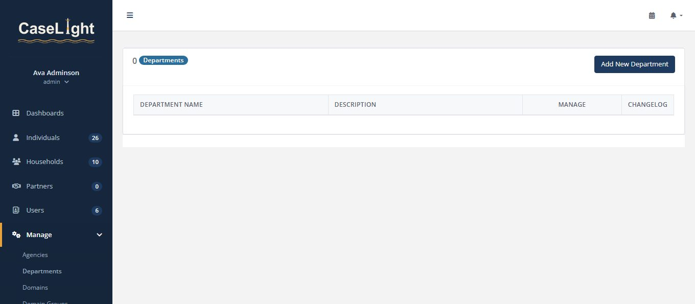
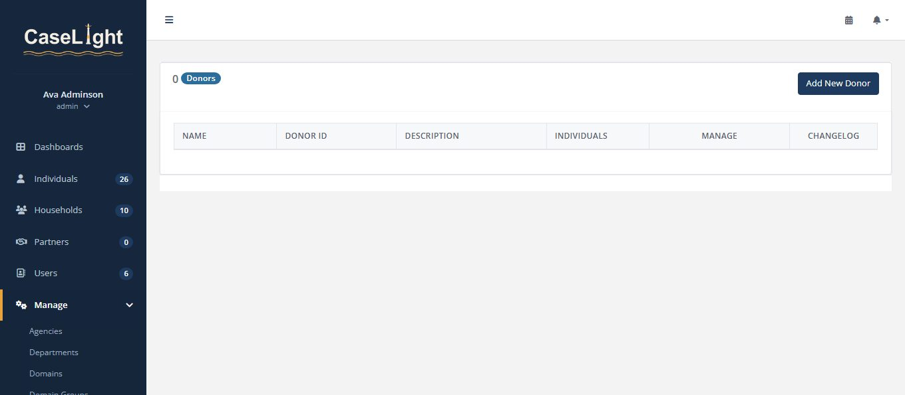
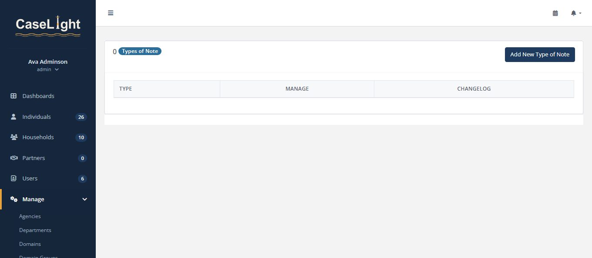

<!-- Source for docs/pdf/CaseLight-Administrator-Guide.pdf — build with docs/build-pdfs.js.
     (Reconstructed 2026-07-13: the PDF was originally committed without its markdown source.) -->

# CaseLight — Administrator Guide

**Configuring & securing CaseLight** — set up users, tailor the system to your programs
without code, and operate its security controls: everything under **Manage** and the admin
surfaces.

> **All screenshots in this guide show synthetic demo data** — fictional names, addresses,
> and records.

## 1 · Users & access

Under **Users**, add a staff account for each person and assign a role — the role decides
what they can see and do (see the User Guide's role table). Add a user, set their role, and
export the roster to XLS.

<em>Users — one account per staff member.</em>

### Access Review — periodic recertification

The **Access Review** report (AC-2) lists every account with its role, last sign-in, MFA and
passkey status, and whether it's locked or disabled. It flags disabled staff who still hold
caseloads, and summarizes the least-privilege and authorization shadow windows. Export to
CSV for your records.

<em>Access Review — recertify accounts and catch orphaned caseloads.</em>

## 2 · Configure without code: the form builder

Rather than editing the data model, add **custom forms** (attachable to individuals,
households, users, or partners) with a drag-and-drop builder under **Manage → Form
Builder**.

<em>The form builder — choose type, frequency, and the form's sensitivity, then drag in fields.</em>

Every form carries a **sensitivity**, set at design time:

- **Standard** — any authorized reader of the record.
- **Restricted** — caseload- or role-scoped readers only.
- **Emergency only** — hidden unless a break-glass grant is active (see §6).

> Because sensitivity is chosen when the form is designed, a brand-new form can never
> accidentally expose data — it inherits an explicit classification from the start.

## 3 · Program streams

Define the programs your organization actually runs under **Manage → Programs**.
Each stream is enrollable, has its own custom form, and supports recurring, date-stamped
trackings.

<em>Program streams — the enrollable programs behind every case.</em>

## 4 · Assessment domains & groups

The assessment engine scores needs across **life domains**, organized into **domain
groups**. Configure both under Manage, and set each domain's **sensitivity** so the most
protected domains stay restricted.

<em>Domain groups.</em>

<em>Domains (with sensitivity).</em>

## 5 · Reference data

The lists that populate dropdowns and organize your work — all editable under **Manage**.
Keep them tidy and every record downstream stays consistent.

  
  

<em>Agencies — partner and referring organizations. · Departments — internal structure for staff.</em>

  
  

<em>Referral sources — how clients reach you. · Donors — funding sources for reporting.</em>

  
  

<em>Quantitative types — countable service categories. · Types of Note — categories for progress notes.</em>

### Partners

External **Partners** (agencies you coordinate with) get their own records and custom forms,
tracked separately from the individuals you serve.

<em>Partners.</em>

## 6 · Security enforcement & break-glass

The **Security Enforcement** panel turns live security controls on or off for your
organization, each mapped to a NIST 800-53 control, and each showing a **shadow window** —
what the stricter rule *would have* denied — so you can review impact before enabling.

<em>Security Enforcement — per-organization control toggles.</em>

| Control | NIST | What it does |
|---|---|---|
| Global authorization | AC-3 | Require every action to authorize explicitly. |
| Least-privilege narrowing | AC-6 | Scope reads to need-to-know. |
| Tenant-boundary tripwire | SC-7 | Refuse any cross-tenant request. |
| MFA & idle timeout | IA-2 · AC-12 | Require MFA; invalidate idle sessions. |
| Lockout & password expiry | AC-7 · IA-5 | Lock after failed sign-ins; rotate passwords. |
| Inactive-account auto-disable | AC-2(3) | Disable dormant accounts automatically. |

### Break-glass emergency access

When a genuine life-safety need requires an emergency-only field, an eligible worker can
self-elevate for **one hour** — with a mandatory reason and the audit record written
*first*. Access is scoped to the specific record, expires automatically, and is fully
logged.

## 7 · Data protection & privacy

CaseLight is hardened at the application layer toward **NIST 800-53 Moderate** and **SOC 2**
(Security, Confidentiality, Privacy), and aligns with the **HIPAA Security Rule**.

- **Field-level sensitivity** — Standard / Restricted / Emergency-only on forms and domains;
  records mask what a role isn't cleared to see.
- **Encryption at rest** — sensitive PII is encrypted in the database across multiple tiers.
- **Append-only audit trail** — reads and changes logged to a separate, tenant-isolated
  store, with change history and retention.
- **Tenant isolation** — each organization is its own subdomain and database schema.
- **Data lifecycle** — retention/deletion routines, guarded and audited deletion, and a
  subject-access export.

> The full compliance package — System Security Plan, SOC 2 control matrix, policies, POA&M,
> and a reproducible `rake compliance:evidence` bundle — lives in `docs/compliance/`.
> Data-handling posture and the production gate for real client data are in `SECURITY.md`.
> **Pilot data is synthetic only.**
