

  <picture>
    <source media="(prefers-color-scheme: dark)" srcset="../app/assets/images/brand/caselight-logo-ondark.png">
    
  </picture>

# CaseLight — User Guide

CaseLight is a case-management system for refugee resettlement and other frontline nonprofits.
It tracks the people you serve, the households they belong to, the programs they move through,
and the assessments and notes that record how the work is going — with security controls usually
reserved for far more expensive software.

This guide walks through the app the way staff actually use it, role by role and screen by screen.

> **If you cannot see a feature this guide describes, it is probably not missing — your role's
> permissions may not include it.** Ask your administrator before assuming something is broken.

> **All screenshots in this guide show synthetic demo data** — fictional names, addresses, and
> records generated for demonstration. No real client information appears anywhere.

> **Printable editions:** polished PDFs live in [`docs/pdf/`](pdf/) —
> [User Guide](pdf/CaseLight-User-Guide.pdf),
> [Administrator Guide](pdf/CaseLight-Administrator-Guide.pdf), and a
> [Brochure](pdf/CaseLight-Brochure.pdf).

## Contents

1. [Signing in](#1-signing-in)
2. [Protecting your account](#2-protecting-your-account)
3. [Roles at a glance](#3-roles-at-a-glance)
4. [Your first week](#4-your-first-week)
5. [The dashboard](#5-the-dashboard)
6. [Finding people: individuals, households & search](#6-finding-people-individuals-households--search)
7. [The household record](#7-the-household-record)
8. [The individual record](#8-the-individual-record)
9. [Programs & enrollments](#9-programs--enrollments)
10. [Case notes](#10-case-notes)
11. [Assessments & domains](#11-assessments--domains)
12. [Tasks & notifications](#12-tasks--notifications)
13. [The calendar](#13-the-calendar)
14. [Custom forms — the form builder (administrators)](#14-custom-forms--the-form-builder-administrators)
15. [Security & administration (administrators)](#15-security--administration-administrators)
16. [Data protection & privacy](#16-data-protection--privacy)
17. [Change history](#17-change-history)
18. [Administration reference — the Manage menu](#18-administration-reference--the-manage-menu)
19. [Troubleshooting & FAQ](#19-troubleshooting--faq)
20. [Glossary](#20-glossary)

**Reading paths.** Case workers: read §1–§13 — that is the day-to-day toolset. Managers: add
§12 (the notifications and active-task views are your supervision tools) and §17. Administrators:
this whole guide plus the **[Administrator Guide](pdf/CaseLight-Administrator-Guide.pdf)**, which
covers configuration in depth.

---

## 1. Signing in

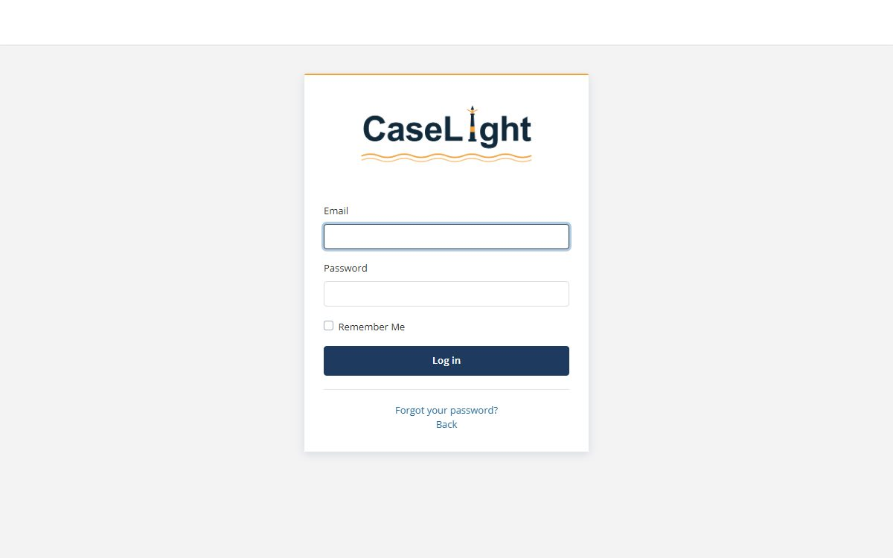

Each staff member has their own account — one person per login, so the audit history is meaningful.
Sign in with your email and password. CaseLight supports two additional protections:

- **Multi-factor authentication (MFA)** — a time-based one-time code from an authenticator app, with
  one-time recovery codes.
- **Passkeys** — phishing-resistant WebAuthn sign-in (Face ID / Touch ID / a security key), via the
  **"Sign in with a passkey"** button.

Administrators can require MFA for privileged roles. Repeated failed sign-ins lock an account
temporarily; it unlocks automatically after a set interval. If your organization has password
expiry enabled, CaseLight will route you to a change-password screen when your password ages out —
that is expected, not an error.

## 2. Protecting your account

Both protections are self-service — open the **profile menu** (your name, bottom of the sidebar):

- **Two-factor authentication** — scan the QR code with any authenticator app (1Password, Google
  Authenticator, Authy…), confirm a code, and **save your recovery codes** somewhere safe. Each
  recovery code works once, for a day you don't have your phone; you can regenerate the set at any
  time (which invalidates the old ones).
- **Passkeys** — register the device you actually work on (laptop fingerprint reader, phone,
  hardware key). You can register several and remove any of them later.

Choose a strong, unique password. It isn't just your account you're protecting — it's your
clients' records.

## 3. Roles at a glance

CaseLight shows the **same records** to everyone who's authorized, but presents them in the way each
role works — and limits what lower-privilege roles can see.

| Role | Sees | Individuals view |
|---|---|---|
| **Administrator** | Everything; manages users, forms, programs, and security | Dense table |
| **Strategic overviewer** | Read-only overview across the organization (standard-sensitivity data) | Dense table |
| **Manager** | The caseloads of the case workers they manage | Cards |
| **Case worker** | The clients assigned to them, plus those clients' households | Cards |
| **Specialized managers** (EC / FC / KC / Able) | Program-specific management | Cards |

Sensitive fields are additionally gated by **field-level sensitivity** (see
[§16](#16-data-protection--privacy)) — a role that can open a record still won't see fields marked
above its clearance.

## 4. Your first week

The day-one path, in order:

1. **Sign in** with the credentials your administrator created ([§1](#1-signing-in)).
2. **Enroll MFA and save your recovery codes** ([§2](#2-protecting-your-account)) — do this before
   anything else.
3. **Open Individuals** — the cards you see are your caseload ([§6](#6-finding-people-individuals-households--search)).
4. **Open one person's record** and read the Overview top to bottom; check their household's
   **Alerts** tab for anything marked "read first" ([§7](#7-the-household-record), [§8](#8-the-individual-record)).
5. **Log your first case note** after your first contact ([§10](#10-case-notes)).
6. **Set a task** for your next follow-up, from the note itself or the calendar
   ([§12](#12-tasks--notifications), [§13](#13-the-calendar)).
7. **Watch the bell** — from now on, overdue work finds you ([§12](#12-tasks--notifications)).

The rhythm of the work is a loop: **assess → plan → do the tasks → write it up in case notes →
reassess**. Every tool in this guide serves one leg of that loop.

## 5. The dashboard

The dashboard is the landing page after sign-in. It summarizes the organization at a glance:

- **Headline counts** — households, individuals, active program enrollments, and programs offered.
- **Flash metrics** — overdue tasks, tasks due today, new individuals this month, and check-ins
  this month.
- **Active enrollments by program** — how many people are currently in Housing, Employment,
  Immigration/Legal, Education, Benefits, and so on.
- **Households** — every household with its member count, each a link into the record.
- **Recent program activity** — the latest dated updates across the caseload.

## 6. Finding people: individuals, households & search

Every person in CaseLight is an **individual**, and every individual belongs to a **household**.
Households are listed under **Households**; individuals under **Individuals**.

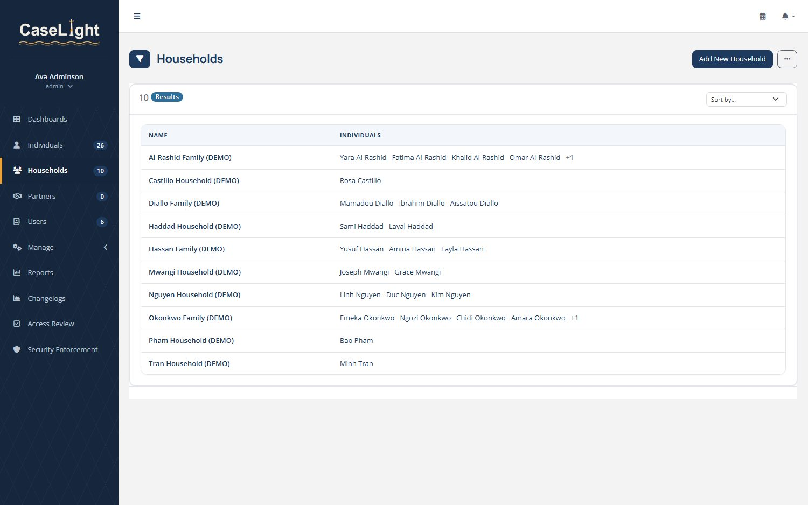

Depending on your role, the **Individuals** list appears one of two ways:

**Administrators & strategic overviewers** get a dense, sortable table — name, case manager,
gender/age, status, and program-stream tags — with export and advanced search:

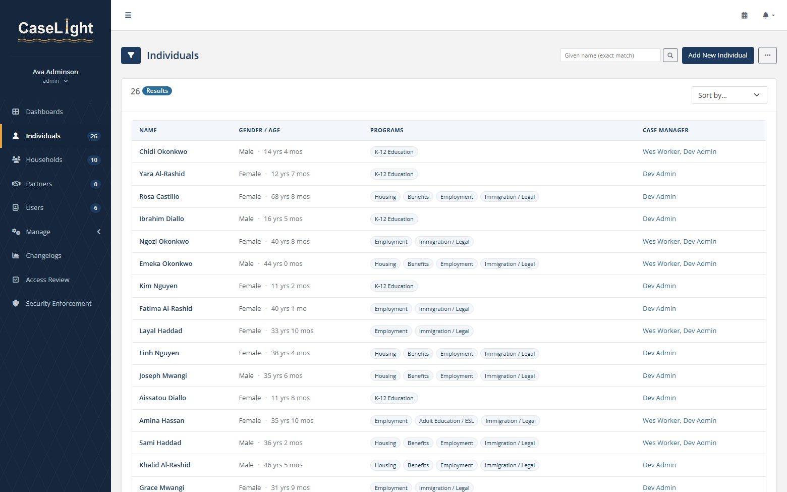

**Managers & case workers** get a card per person, scoped to the caseload they carry:

From either view the header offers:

- **Quick search by first or last name.** Type either name — `maria`, `Hassan`, or a full
  `Maria Gonzalez` — in any capitalization. It matches whole names (not fragments), so `mar`
  won't find Maria but `maria` will.
- A **Sort by…** menu — first name, last name, status, ID, age, or state, ascending or
  descending. Households sort by name, member count, or state.
- An **Add New Individual** button, and a **"⋯" menu** with Reports, Advanced Search,
  View All Active Tasks, and the exports.

Active search filters show as dismissible **chips** under the header — click a chip's × to clear
that filter. Click anywhere on a card (or a name in the list) to open the record; each card's
program chips jump straight to that program.

**Advanced Search** (in the "⋯" menu) is the report builder: pick the columns you care about —
basic fields, custom-form fields, or program-stream fields — then stack filter rules on top and
export the result to XLS. If a search returns nothing you expected to find, check the filter
chips first: an over-narrow rule (two mutually exclusive conditions joined with AND) returns
zero rows.

Administrators also get a **Reports** button on the Individuals page — charts of assessment
domain scores and case statistics across the organization.

## 7. The household record

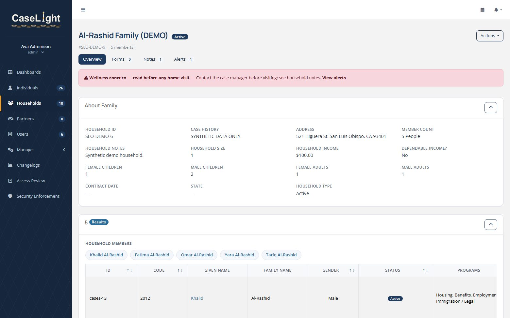

Households have a full record of their own — the shared context that individual records hang off.
The page keeps a persistent header — household name, type, status, and counts — with an
**Actions** menu (edit, add form, new household note, new alert, delete) and four tabs:

- **Overview** — an About grid (address, contact, type, status…), the **household members**
  list (each member links to their individual record), and any custom-form panes.
- **Forms** — the household's filled custom forms, same layout as an individual's Forms tab
  ([§8](#8-the-individual-record)).
- **Notes** — **household notes**: the shared narrative that belongs to the whole household
  (a housing inspection, a home visit that involved everyone) rather than to one member's case
  file. Use an individual's case notes for casework about that person; use household notes for
  the home.
- **Alerts** — operational warnings the whole team must see before interacting with the
  household.

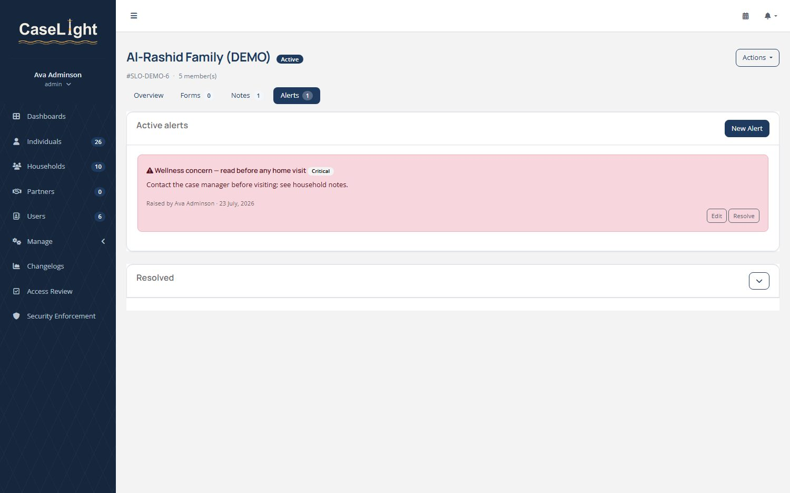

**Household alerts** are the "read this first" mechanism:

- An active alert shows as a **red banner at the top of the household's Overview** — nobody who
  opens the record can miss it.
- Every **member's individual record** shows a red **Household alert** badge in its header while
  any alert is active, so the warning follows the people.
- Alerts are **resolved, never deleted** — resolving one records who resolved it and when, and
  the history stays on the Alerts tab.

Case workers see the households of their own caseload — you can read the household record, read
its alerts, and add household notes for the families you serve.

## 8. The individual record

An individual's page brings the whole picture together under a persistent header — the person's
name, status, date of birth, code, household, and (when relevant) a red **Household alert** badge
— with an **Actions** menu and tabs that follow you across every sub-page:

- **Overview** — the **About** section first: one label-over-value grid holding the person's
  details *and* the resettlement-case facts (intake date, case household, case status), with
  **Edit Resettlement Case** and **Exit From Case** close to hand. Below it: **Programs** and
  **recent program activity** panes, then any screening answers.
- **Programs** — enrolled programs (with exit/tracking actions) above the programs available
  to enroll.
- **Forms** — every filled custom form in one table: form name, entry count, latest entry, and
  **View entries / Add entry** actions, with the forms still available to add listed below.
  Forms marked **emergency-only** appear as locked rows: staff who qualify can **Request
  access** — a 1-hour, reason-required break-glass grant (the header shows a countdown chip
  while access is active).
- **Case Notes / Assessments / Tasks** — each one click away, with counts on the tabs.

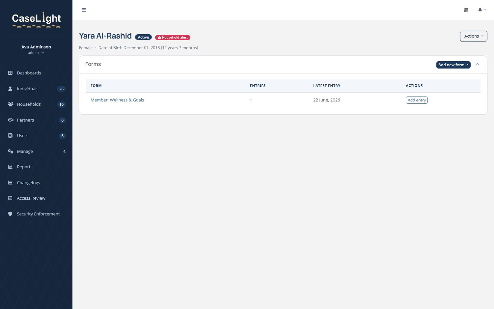

The **Actions** menu is the same everywhere in the record — you never have to hunt for the right
tab to act. It gathers: Edit, the case actions (edit / exit the resettlement case, or open the
active EC/FC/KC case), New Case Note, Add Form, New Assessment, New Task, progress notes, case
history, and (for authorized roles) Delete.

Two small conveniences worth knowing: sections with nothing in them start **collapsed** — the
chevron in a section's corner expands it; and after you pick a destination from the left menu,
the sidebar folds itself away to give the record the full width. Click the menu icon to pin it
back open.

## 9. Programs & enrollments

**Programs** are enrollable services — each with its own custom form and recurring,
date-stamped check-ins ("trackings"). Administrators define the programs the organization
actually runs.

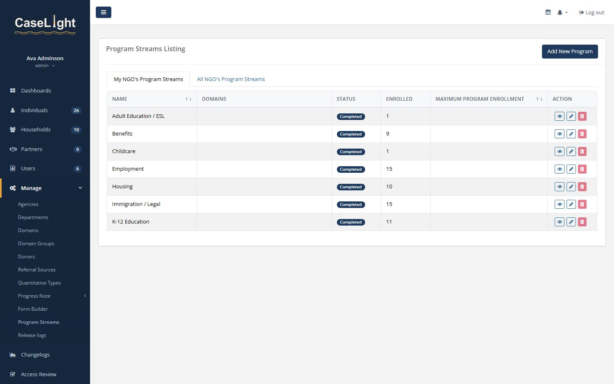

Enroll an individual in one or more programs, then log dated trackings against each enrollment
as the work progresses. The history of the case is captured as it happens.

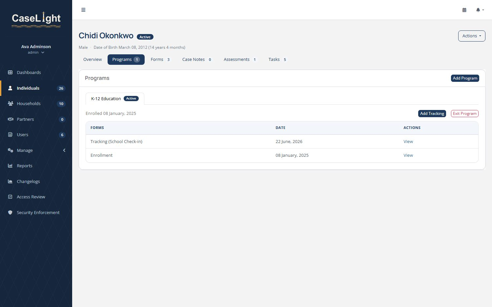

**Leaving a program.** When someone completes (or exits) a program, use the program's exit
action — it captures the program's exit form with the leave date. Exited enrollments stay
visible on the Programs tab below the active ones, and every tracking entry remains exportable
per enrollment, so the record of the work survives the exit.

**Tracking form or custom form?** If the data belongs to a *program* — a recurring check-in
that only makes sense while someone is enrolled — it's a tracking on that program. If it
belongs to the *person or household* regardless of program (an intake document, a housing
inspection), it's a custom form ([§14](#14-custom-forms--the-form-builder-administrators)).
When in doubt: "would we still record this if they left the program?" — yes means custom form.

## 10. Case notes

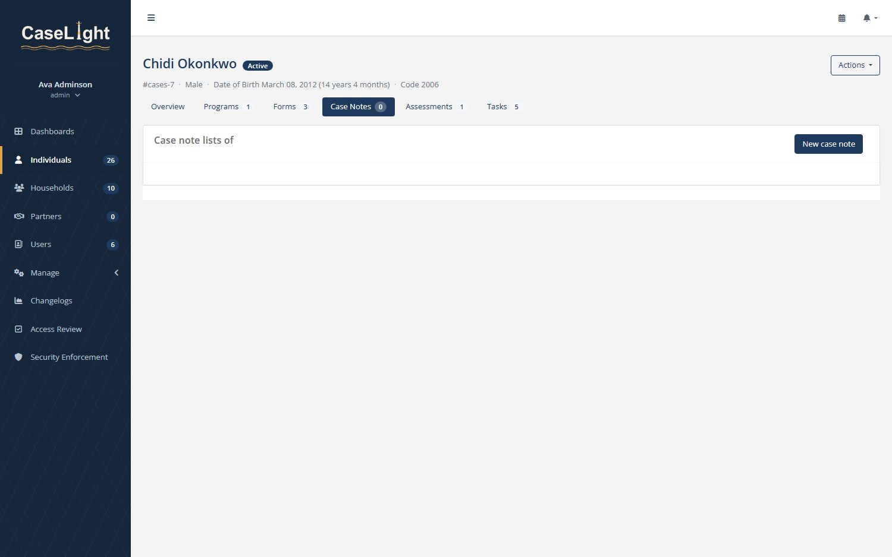

Case notes are the running narrative of the work with a person — dated entries attached to the
individual, visible to the staff authorized to see that record. A good case note is the handover
document your colleague reads when they cover for you: objective, factual, respectful, and
concise.

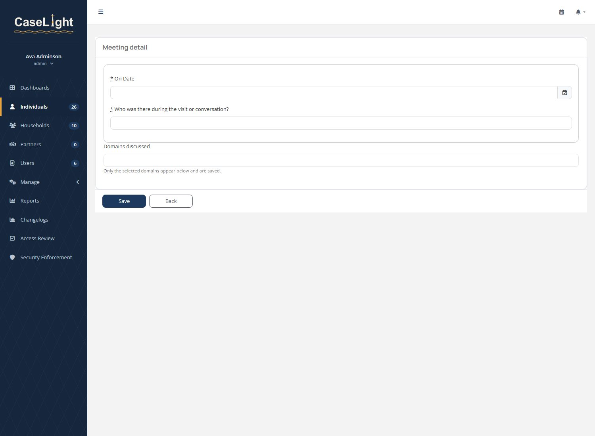

Writing one (from the **Actions** menu or the Case Notes tab):

- Record the **meeting date** and **who was present**.
- Pick the **domains discussed** — only the domains you select appear on the form and are
  saved, so a quick housing check-in is a short form, not a scroll past every domain the
  organization tracks.
- **Attach files** where the paper trail matters (a signed form, a notice) — attachments are
  stored against the note and download through the same authorization checks as the record.
- **Add follow-up tasks** right inside the note — the "what's next" of the visit becomes a
  dated task without leaving the page.

## 11. Assessments & domains

CaseLight includes a structured **assessment** engine: periodic, scored needs assessments across
**life domains** (for example Health, Mental Health, Immigration Status, Personal Safety, Education).
Administrators configure the domains and their scoring under **Manage → Domains**.

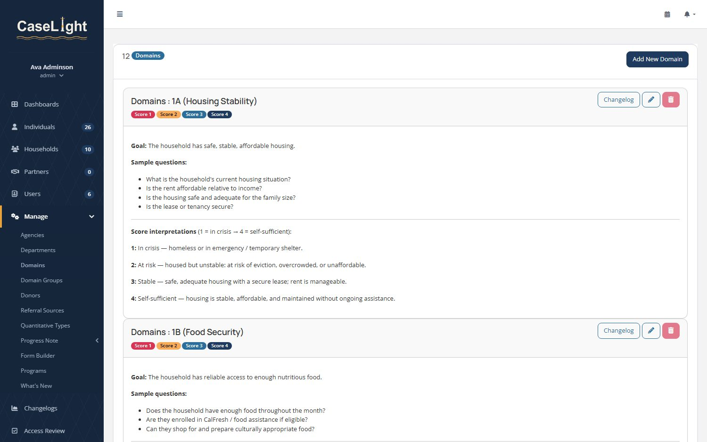

Running one: start it from the Assessments tab (or **Actions → New Assessment**), work through
each domain — score, observations, any attachments — and save. Repeating the assessment at the
cadence your organization sets is what turns scores into a *trajectory*: the domain-by-domain
picture of whether things are improving. Assessments that come due appear in the notification
bell ([§12](#12-tasks--notifications)).

Each domain can be marked with a **sensitivity level**, so the most protected domains (for example
Mental Health or Immigration Status) are only visible to appropriately cleared roles.

## 12. Tasks & notifications

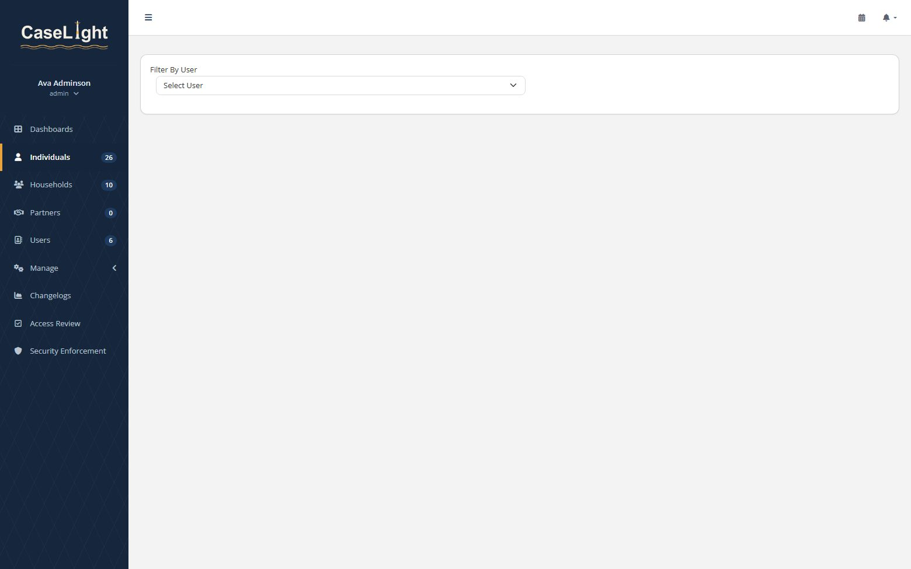

Tasks are how follow-ups survive a busy week. There are three ways to create one, and all three
produce the same thing — a dated task attached to a person (and optionally a program and domain):

1. From a person's **Tasks tab** (or **Actions → New Task**).
2. By **clicking a day on the calendar** ([§13](#13-the-calendar)).
3. **Inside a case note**, as the follow-up to the visit you're writing up ([§10](#10-case-notes)).

**View All Active Tasks** (in the Individuals "⋯" menu) shows your whole task load grouped by
urgency — overdue, due today, upcoming — person by person. Managers can filter it by case worker,
which makes it the supervision view: where is the backlog, who needs help this week.

The **bell** in the top bar is the same information pushed to you: overdue and due-today tasks,
assessments coming due, custom forms whose frequency says they're due again, program trackings
due, and exit-window reminders. Each line links to a pre-filtered list. If the bell shows a
number, that's the day's real to-do list.

## 13. The calendar

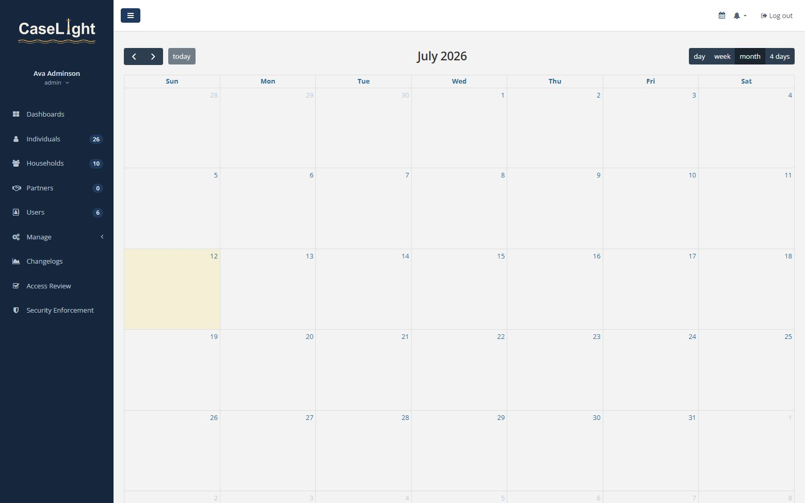

Appointments, recertification dates, and program milestones appear on a shared calendar with
month / week / day views. Each user sees the events for the caseloads they're allowed to see.
Clicking a day lets you schedule a task against a program, person, and domain.

If your account has **Google Calendar sync** enabled (a per-user opt-in an administrator sets on
your user record), your CaseLight calendar can sync to Google; without it the calendar works
exactly the same, just inside CaseLight.

## 14. Custom forms — the form builder (administrators)

CaseLight is configurable **without code**. Rather than editing the data model, administrators add
**custom forms** (attachable to individuals, households, users, or partners) using a drag-and-drop
builder under **Manage → Form Builder**.

Choose the record **type**, an optional **frequency**, and — importantly — the form's **sensitivity**:

- **Standard** — any authorized reader of the record.
- **Restricted** — caseload- or role-scoped readers only.
- **Emergency only** — hidden unless a **break-glass** grant is active (see below).

Then drag fields (text, number, date, select, checkbox/radio groups, file upload, text area) into the
form. When the organization needs to capture something new, an administrator designs it here — no
developer and no database migration required. Household forms appear on the household's **Forms**
tab; individual forms on the person's. The **[Administrator Guide](pdf/CaseLight-Administrator-Guide.pdf)**
covers field-design judgment (which widget for which question) in more depth.

## 15. Security & administration (administrators)

CaseLight surfaces its security posture to the administrators who own it, rather than hiding it in a
vendor's data center. The three admin surfaces, in brief — the
**[Administrator Guide](pdf/CaseLight-Administrator-Guide.pdf)** is the full treatment:

### Access Review

**Access Review** (under the main menu) is a periodic account-recertification report: every account
with its role, last sign-in, MFA and passkey status, and whether it's locked or disabled. It also
flags **disabled staff who still hold caseloads** and summarizes the least-privilege and
authorization "shadow" windows. Export it to CSV for your records.

### Security Enforcement

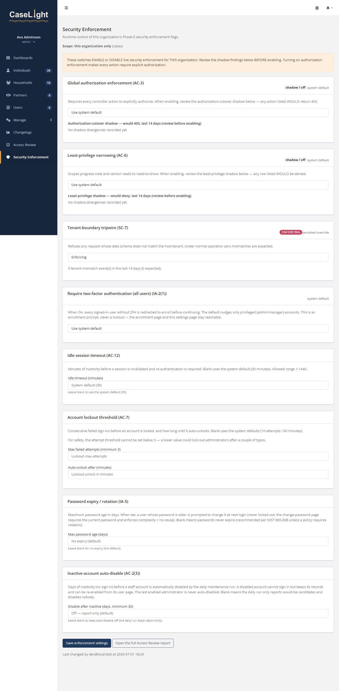

The **Security Enforcement** panel lets an administrator turn live security controls on or off **for
their organization** — global authorization enforcement, least-privilege narrowing, the
tenant-boundary tripwire, required MFA, idle session timeout, lockout threshold, password expiry,
and inactive-account auto-disable — each mapped to a NIST 800-53 control. Each control shows a
**shadow window** — what the stricter rule *would* have denied — so you can review the impact
before changing it. The three authorization controls are **on by default** in production (since
2026-07-26); your panel settings override the default in either direction, and every change is
audited. Requiring MFA follows the enforcement-window practice: turn it on only after your staff
have had time to enroll their authentication of choice.

### Break-glass emergency access

When a genuine life-safety need requires seeing an **emergency-only** field, an eligible worker can
**self-elevate for one hour** — with a **mandatory reason** and the audit record written *first*.
Access is scoped to the specific record, expires automatically, and is fully logged.

## 16. Data protection & privacy

CaseLight is hardened at the application layer toward **NIST 800-53 Moderate** and **SOC 2**
(Security, Confidentiality, Privacy), and aligns with the **HIPAA Security Rule**. Highlights:

- **Field-level sensitivity** — Standard / Restricted / Emergency-only on forms and assessment
  domains; records mask what a role isn't cleared to see.
- **Encryption at rest** — sensitive PII is encrypted in the database across multiple tiers
  (client names are encrypted in a way that still allows the case-insensitive name search of
  [§6](#6-finding-people-individuals-households--search)).
- **Append-only audit trail** — record reads and changes are logged to a separate, tenant-isolated
  store, with change history and retention.
- **Tenant isolation** — each organization is its own subdomain and database schema.
- **Data lifecycle** — retention/deletion routines, guarded and audited deletion, and a
  **subject-access export** for producing everything held about an individual.

**What this means for you day to day:** opening a sensitive record is *recorded*, not forbidden —
the system's stance is "access with accountability." Break-glass access, record reads on sensitive
data, and every change all leave an audit trail with your name on it. That trail is what lets the
organization say yes to giving frontline staff real access.

The full compliance package lives in [`docs/compliance/`](compliance/) — the System Security Plan,
SOC 2 control matrix, policies, and a reproducible evidence bundle. Data-handling posture and the
production gate for **real** client data are in [`../SECURITY.md`](../SECURITY.md).

> **Pilot data is synthetic only.** Moving to real client records is a deliberate, separate decision
> that requires meeting the production gate documented in `SECURITY.md`.

## 17. Change history

Every record keeps its history:

- **Case history** on an individual's Actions menu shows that record's changes over time —
  who changed what, when. Households, users, and other record types have the same view.
- **Changelogs** (in the sidebar, for authorized roles) is the organization-wide version: browse
  recent changes across all record types, filtered by type — the place to answer "what changed
  yesterday?" without opening records one by one.

Names and other sensitive values are redacted from history entries by design — the history shows
*that* a field changed and who changed it, without duplicating the sensitive value into the
history store.

---

## 18. Administration reference — the Manage menu

Administrators configure CaseLight from the **Manage** menu (plus **Users** and **Partners**). The form
builder ([§14](#14-custom-forms--the-form-builder-administrators)), program streams
([§9](#9-programs--enrollments)), and assessment domains ([§11](#11-assessments--domains)) are covered
above; the remaining items are reference lists that populate dropdowns and organize your work. The
**[Administrator Guide PDF](pdf/CaseLight-Administrator-Guide.pdf)** is the full walkthrough.

### Users

One account per staff member, each with a role. Add users, disable accounts when staff leave
(disabling preserves their work history — prefer it over deletion), and export the roster to XLS.

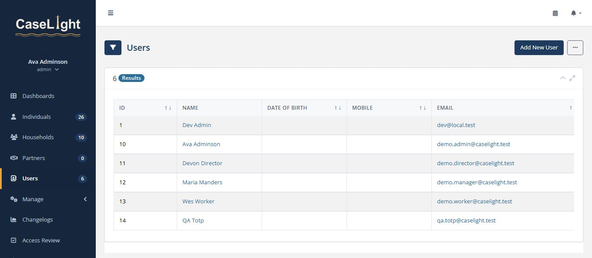

### Reference lists

| Manage item | What it's for |
|---|---|
| **Agencies** | Partner and referring organizations |
| **Departments** | Internal structure for staff |
| **Domain Groups** | Grouping for assessment domains |
| **Donors** | Funding sources, for reporting |
| **Referral Sources** | How clients reach you |
| **Quantitative Types** | Countable service categories |
| **Types of Note** | Categories for progress notes |

  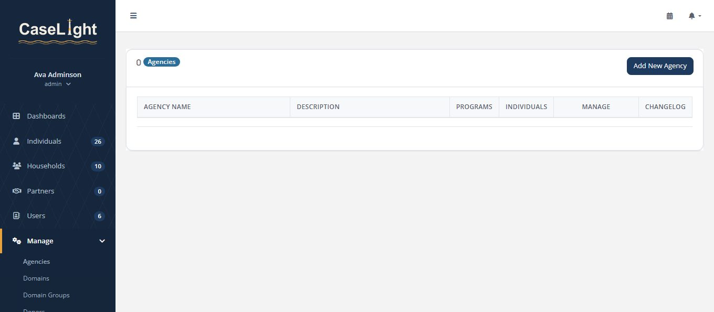
  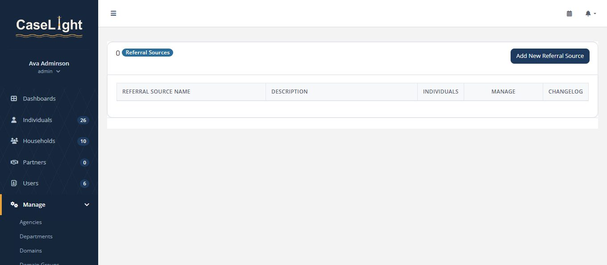

  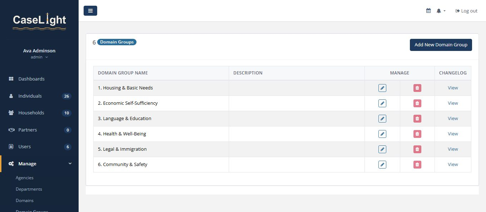
  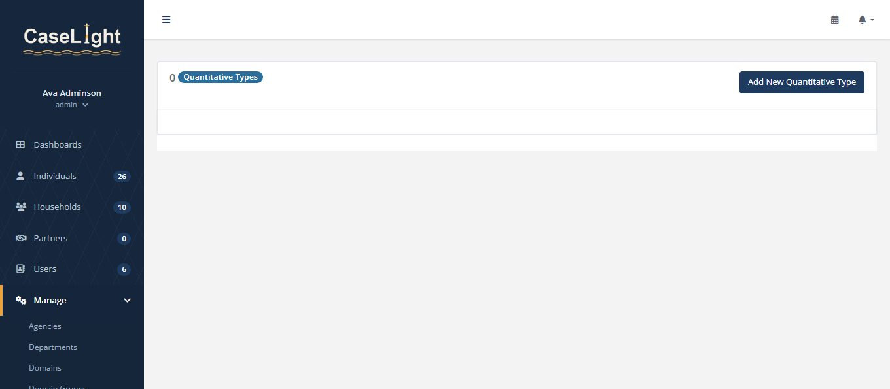

### Partners

External partner organizations you coordinate with get their own records and custom forms, tracked
separately from the individuals you serve.

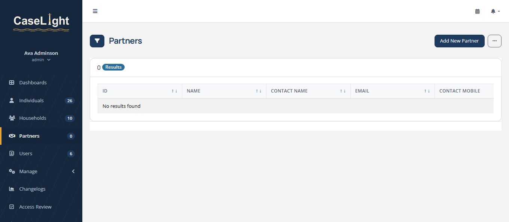

## 19. Troubleshooting & FAQ

**"My account is locked."** Too many failed sign-ins. It unlocks itself after a set interval —
wait, then try again (or ask an administrator). If you've lost your MFA device, use a recovery
code; if those are gone too, an administrator can help.

**"I was forced to change my password."** Password expiry is on for your organization. Pick a new
one and carry on — nothing is wrong.

**"A form shows as a locked row with 'Request access'."** The form is marked emergency-only.
If you qualify for break-glass access, requesting it grants one hour with a logged reason
([§15](#15-security--administration-administrators)); otherwise ask the record's manager.

**"I can't see a household / individual I expected."** Your view is caseload-scoped: case workers
see their assigned clients and those clients' households. If someone should be on your caseload,
your manager or an administrator assigns them.

**"Search doesn't find someone I know exists."** Quick search matches whole first or last names —
`mar` won't find Maria. Check the spelling, try the other name, or clear any active filter chips
under the header. In Advanced Search, an impossible AND (two conditions that can't both be true)
returns zero rows — switch to OR or remove a rule.

**"An empty section disappeared."** Sections with no content start collapsed — click the chevron
to expand. The sidebar also collapses itself after you navigate; the menu icon pins it back.

**"Editing a program stream warns me about existing enrollments."** Changing a program's form
affects everyone already enrolled — the warning is asking you to confirm you mean it. When
unsure, talk to whoever owns the program's reporting before saving.

## 20. Glossary

| Term | Meaning |
|---|---|
| **Individual** | A person you serve (a "client" in older case-management systems). |
| **Household** | The family/home unit an individual belongs to; has its own record, forms, notes, and alerts. |
| **Household note** | Narrative attached to the whole household rather than one member. |
| **Household alert** | A "read first" warning banner on a household, badged onto every member's record; resolved, never deleted. |
| **Program (stream)** | An enrollable service with its own enrollment form, trackings, and exit form. |
| **Enrollment** | One person's participation in one program, from enroll to exit. |
| **Tracking** | A recurring, date-stamped check-in form attached to an enrollment. |
| **Custom form** | An admin-designed form attached to a person, household, user, or partner — the no-code way to capture new data. |
| **Entry** | One filled-out instance of a custom form (forms can be filled repeatedly). |
| **Assessment** | A periodic, scored evaluation across life domains. |
| **Domain / domain group** | One assessed life area (Housing, Health…) and the groupings they're organized into. |
| **Case note** | A dated narrative entry about work with an individual. |
| **Sensitivity** | A field/form/domain classification — Standard, Restricted, or Emergency-only — that gates who sees it. |
| **Break-glass** | Reason-required, fully-audited 1-hour self-elevation to see emergency-only data. |
| **Case history / Changelogs** | Per-record and organization-wide views of who changed what, when. |
| **Shadow window** | A security control running in report-only mode: it records what it *would* deny, before you enforce it. |
